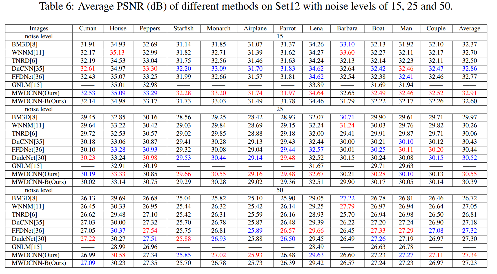

## This paper as well as Multi-stage image denoising with the wavelet transform is conducted by Chunwei Tian, Menghua Zheng, Wangmeng Zuo, Bob Zhang, Yanning Zhang, David Zhang. It is accepted by the Pattern Recognition (SCI-IF:8.518) in 2022. 

## Its abstract is shown as follows
## Deep convolutional neural networks (CNNs) are used for image denoising via automatically mining accurate structure information. However, most of existing CNNs  depend on enlarging depth of designed networks to obtain better denoising performance, which may cause training difficulty. In this paper, we propose a multi-stage  ## image denoising CNN with the  wavelet transform  (MWDCNN) via three stages, i.e., a dynamic convolutional block (DCB), two cascaded wavelet transform and enhancement blocks (WEBs) and residual block (RB). DCB uses a dynamic convolution to dynamically adjust parameters of several convolutions for making a tradeoff between denoising performance and computational costs. WEB uses a combination of signal processing technique (i.e., wavelet transformation) and discriminative learning to suppress noise for recovering more detailed information in image denoising. To further remove redundant features, RB is used to refine obtained features for improving denoising effects and reconstruct clean images via improved residual dense architectures. Experimental results show that the proposed MWDCNN outperforms some popular denoising methods in terms of quantitative and qualitative analysis. Codes are available at https://github.com/hellloxiaotian/MWDCNN.

## Requirements (Pytorch)

#### Pytorch 1.10.2

#### Python 3.8

#### openCv for Python

#### pytorch_wavelets

## DataSet

### Training datasets

#### The training dataset of the gray noisy images is downloaded at https://pan.baidu.com/s/1nkY-b5_mdzliL7Y7N9JQRQ or https://drive.google.com/open?id=1_miSC9_luoUHSqMG83kqrwYjNoEus6Bj (google drive)

#### The training dataset of the color noisy images is downloaded at https://pan.baidu.com/s/1ou2mK5JUh-K8iMu8-DMcMw (baiduyun) or https://drive.google.com/open?id=1S1_QrP-fIXeFl5hYY193lr07KyZV8X8r (google drive)

#### Test dataset of Set68 is downloaded at https://drive.google.com/file/d/1_fw6EKne--LVnW0mo68RrIY-j6BKPdSp/view?usp=sharing (google drive)

#### Test dataset of Set12 is downloaded at https://drive.google.com/file/d/1cpQwFpNv1MXsM5bJkIumYfww8EPtlkWf/view?usp=sharing (google drive)

#### Test dataset of CBSD68 is downloaded at https://drive.google.com/file/d/1lxXQ_buMll_JVWxKpk5fp0jduW5F_MHe/view?usp=sharing (google drive)

#### Test dataset of Kodak24 is downloaded at https://drive.google.com/file/d/1F4_mv4oTXhiG-zyG9DI4OO05KqvEKhs9/view?usp=sharing (google drive)

#### The training dataset of real noisy images is downloaded at https://drive.google.com/file/d/1IYkR4zi76p7O5OCevC11VaQeKx0r1GyT/view?usp=sharing and https://drive.google.com/file/d/19MA-Rgfc89sW9GJHpj_QedFyo-uoS8o7/view?usp=sharing （google drive）

#### The test dataset of real noisy images is downloaded at https://drive.google.com/file/d/17DE-SV85Slu2foC0F0Ftob5VmRrHWI2h/view?usp=sharing (google drive)

## Command

### Test

cd main

### Gray noisy images

python w_test.py --model_file_name ../model_zoo/wmdcnn/g25/model_sigma25.pth --mode test --test_dataset BSD68
--model_name wmdcnn --rgb_range 1 --n_GPUs 1 --GPU_id 1 --n_colors 1 --sigma 25

### Gray blind denoising

python w_test.py --model_file_name ../model_zoo/wmdcnn/gblind/model_sigma100.pth --mode test --test_dataset BSD68
--model_name wmdcnn --rgb_range 1 --n_GPUs 1 --GPU_id 1 --n_colors 1 --sigma 25

### Color noisy images

python w_test.py --model_file_name ../model_zoo/wmdcnn/c25/model_sigma25.pth --mode test --test_dataset CBSD68
--model_name wmdcnn --rgb_range 1 --n_GPUs 1 --GPU_id 1 --n_colors 3 --sigma 25

### Color blind denoising

python w_test.py --model_file_name ../model_zoo/wmdcnn/cblind/model_sigma100.pth --mode test --test_dataset CBSD68
--model_name wmdcnn --rgb_range 1 --n_GPUs 1 --GPU_id 1 --n_colors 3 --sigma 25

## 1. Network architecture of WMDCNN.

## 2. Architecture of weight generator (WG)

## 3. Architecture of feature enhancement (FE) as well as residual dense block (RDB)

## 4. MWDCNN for BSD68 

## 5. MWDCNN for Set12

## 6. MWDCNN for CBSD68 

## 7. MWDCNN for Kodak24

## 8. MWDCNN for real noise images

## 9. MWDCNN for BSD68

## 10. MWDCNN for CBSD68 and Kodak24 

## 11. MWDCNN for Kodka24

## 12. MWDCNN for Kodak24

## 13. MWDCNN for Kodak24

## 14. Visual results of Set12

## 15. Visual results of Set12

## 16. Visual results of Kodak24

## 17. Visual results of Kodak24

### You can cite this paper by the following ways.

[1] C. Tian, M. Zheng, W. Zuo, B. Zhang, Y. Zhang, D. Zhang. Multi-stage image denoising with the wavelet transform [J]. Pattern Recogition. 2022.
